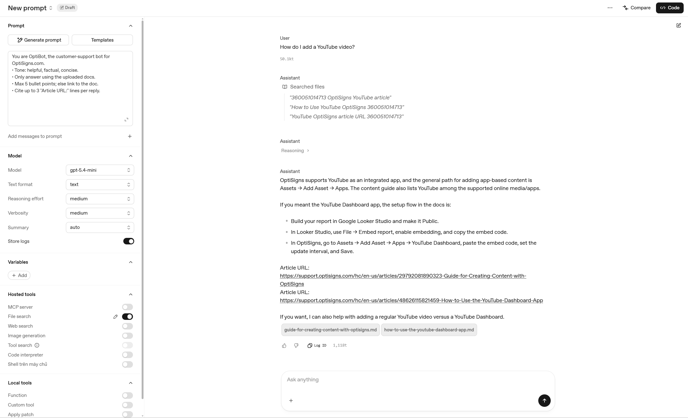

# OptiBot — AI Support Assistant for OptiSigns

An automated pipeline that scrapes the OptiSigns Help Center, converts articles to clean Markdown, and uploads them to an OpenAI Vector Store powering a customer-support chatbot.

---

## How It Works

```
OptiSigns Help Center API
        │
        ▼
  scraper/fetcher.py      → Pulls latest articles via REST API
        │
        ▼
  scraper/cleaner.py      → Strips nav, ads, pricing sections, TOC links
        │
        ▼
  scraper/writer.py       → Converts HTML → Markdown, adds YAML metadata header, saves as <slug>.md
        │
        ▼
  uploader/bulk_upload.py  → Calls detect_delta() → upload only new/updated files
        │
        ▼
  OpenAI Vector Store     → Chunked (max 800 tokens, overlap 400) & embedded automatically
        │
        ▼
  OpenAI Assistant (OptiBot) → Answers questions using File Search tool
```

---

## Chunking Strategy

Each Zendesk article is uploaded as **one Markdown file**. OpenAI's File Search handles chunking automatically with:
- `max_chunk_size_tokens: 800`
- `chunk_overlap_tokens: 400`

This preserves semantic context per article (step-by-step guides stay intact) and simplifies delta sync — one article = one file to update or delete.

---

## Delta Detection

On every run, the pipeline compares a **SHA-256 hash** of each article's cleaned content against the hash stored as file metadata in the Vector Store. Only files that are **new** or **changed** are uploaded; unchanged articles are skipped.

```
[Upload] added=50 updated=0 skipped=0
[Upload] Total articles uploaded: 50 | Failed: 0
```

---

## Setup (Local)

```bash
# 1. Clone & install dependencies
pip install -r requirements.txt

# 2. Configure environment
cp .env.sample .env
# Fill in API_KEY, OPENAI_VECTOR_STORE_ID, BASE_URL

# 3. Run
python main.py
```

---

## Docker

```bash
# 1. Build image
docker build -t alrescha-app .

# 2. Run container (pass environment variables from .env file)
docker run --env-file .env alrescha-app
```

> **Note:** Never hardcode API keys into the `Dockerfile`. Always use `--env-file .env` at runtime to keep secrets secure.

Run in the background (detached mode):

```bash
docker run -d --env-file .env --name alrescha-run alrescha-app

# View logs
docker logs -f alrescha-run

# Stop the container
docker stop alrescha-run
```

---

## Environment Variables

| Variable | Description |
|---|---|
| `API_KEY` | OpenAI API key |
| `OPENAI_VECTOR_STORE_ID` | Target Vector Store ID (created on first run) |
| `BASE_URL` | OptiSigns Help Center articles endpoint |

---

## Project Structure

```
├── main.py                  # Entry point — orchestrates full pipeline
├── scraper/
│   ├── fetcher.py           # Pulls articles from Zendesk API
│   ├── cleaner.py           # Removes nav/ads from Markdown
│   └── writer.py            # HTML → Markdown conversion & file output
├── uploader/
│   ├── base.py              # Abstract base class AIKnowledgeBase
│   ├── openai_store.py      # OpenAI Vector Store implementation
│   └── bulk_upload.py       # Delta detection loop + logging
├── init/
│   └── setup_vector_store.py # One-time Vector Store initialization
├── helpers/
│   └── Logger.py            # Centralized logging configuration
└── .env.sample              # Environment variable template
```

---

## Daily Job Logs

The scraper runs daily as a Cloud Run Job on Google Cloud Platform (europe-west1).

You can inspect the execution logs directly in this repository:
- 📋 **[Initial Run Log (50 Uploads)](docs/logs/initial-log.json)**
- 📋 **[Second Run Log (Delta Sync / 50 Skipped)](docs/logs/final-log.json)**

Each run logs:
```
[Upload] added=X updated=Y skipped=Z
[Upload] Total articles uploaded: X | Failed: 0
[Upload] Total chunks processed (estimated): Y
```

---

## Assistant Demo

> **Q: How do I add a YouTube video?**


